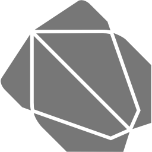
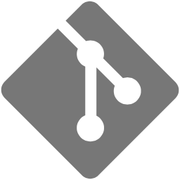

<h1>Namaste 🙏🏼, My name is Ankit Solanki and I'm from 🇮🇳</h1>

&nbsp;&nbsp;

&nbsp;&nbsp;

 

<!-- defaut social icons -->

&nbsp;&nbsp;

&nbsp;&nbsp;

&nbsp;&nbsp;

&nbsp;&nbsp;

&nbsp;&nbsp;

<h3>Enthusiastic mobile application developer eager to contribute to team success through smart work, attention to detail and excellent organizational skills. Clear understanding of task. Motivated to learn, grow and excel in different technology.</h3>

- 👨‍💻 All of my projects are available at [https://ankitsolanki.netlify.app/](https://ankitsolanki.netlify.app/)

- 📫 How to reach me **ankit_ms95@yahoo.com**

- My [GitHub Gist](https://gist.github.com/Ankit-Slnk)

 

 
&nbsp;&nbsp;
 
  
 
&nbsp;&nbsp;
 
  

&nbsp;&nbsp;

  
 
&nbsp;&nbsp;
 
&nbsp;&nbsp;
 
&nbsp;&nbsp;
 
&nbsp;&nbsp;
 
  

